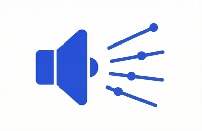

# SoundBar



Sound control windows application.

## 📥 Download & Install (For Users)
The application is built as a completely self-contained, portable `.exe`. You do not need to install anything or download the Windows App SDK runtime!

1. Go to the [Releases](../../releases) tab on the right side of this GitHub repository.
2. Download the latest `SoundBar.zip` file.
3. Extract the folder anywhere on your computer.
4. Double click `SoundBar.exe` to run the app!

> **Note on Windows SmartScreen:** Because this is a new open-source application, Windows may show a "Windows protected your PC" warning when you first run the app. This is completely normal for new independent software. To run the app, simply click **"More info"** and then **"Run anyway"**.

## 🛠️ Building for Release (For Developers)
If you are compiling this project from source and want to generate the portable folder to upload to GitHub Releases, run the following command in your terminal:

```bash
dotnet publish -c Release -p:Platform=x64 -p:PublishProfile=Properties\PublishProfiles\win-x64.pubxml
```
*(Or simply right-click the project in Visual Studio and click **Publish**, ensuring you target `win-x64` Unpackaged).*

This will generate a self-contained folder containing `SoundBar.exe` and its dependencies. Zip this folder and upload it to your GitHub Release!
